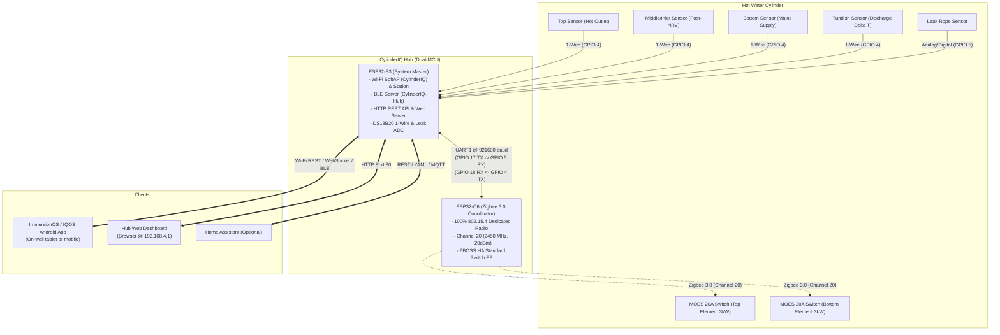

# Handover: Android UI/UX Agent — CylinderIQ / ImmersionOS & IQOS

**Target Agent:** Android UI/UX Engineer / Native & Capacitor App Specialist  
**Project:** CylinderIQ ImmersionOS (DIQ) & IQOS Native Application  
**Context:** Green Energy Group (GEG) Cyprus Renewable Curtailment Monetization Pilot  

---

## 1. Executive Context & The GEG Pilot Purpose

### Background
- **Program & Partner:** Green Energy Group (**GEG**) in Cyprus (GreenSyn Accelerator).
- **Core Domain:** **Renewable Curtailment Monetization** & **Virtual Power Plant (VPP)** / DERMS platforms.
- **The Problem:** Isolated grids and high-PV markets like Cyprus face severe solar curtailment during peak midday insolation (wasted zero-carbon power) while grid operators struggle with frequency swings. Concurrently, domestic hot water cylinders heat up randomly during peak evening grid hours at high cost, and landlords have zero visibility into leaks, PRV discharge, or Legionella compliance.
- **The Solution:** **CylinderIQ (IQOS)** turns domestic hot water cylinders into distributed, flexible thermal grid batteries (3–5 kWh flexible energy storage per home).
- **The "Earned Secret":**
  1. *3-Point Pipe Telemetry Array:* Rather than installing costly £1,500+ smart tanks (e.g. Mixergy) or expensive flow meters, CylinderIQ clips 3x DS18B20 sensors onto existing plumbing (*Mains Cold Inlet, Post-NRV Tank Inlet, Hot Water Outlet*) plus 1x sensor on the *Tundish Discharge Pipe* ($\Delta T$). This calculates usable liters, stored kWh, weeping pressure relief valves (PRV), and non-return valve (NRV) backflow at a fraction of the cost as a 15-minute electrical retrofit.
  2. *De-risked Pre-Certified Hardware:* Employs off-the-shelf, pre-certified 20A immersion switches (MOES 3kW Zigbee relays) controlled by an ESP32-C6 coordinator, avoiding high-voltage certification delays for the 100–500 home GEG pilot.

---

## 2. Hardware Architecture & System Topology



---

## 3. Android App Requirements & Functional Modules

The Android app targets two deployment forms:
1. **ImmersionOS (DIQ):** Dedicated 3.5" or 5" on-wall touchscreen appliance (kiosk mode).
2. **IQOS Mobile:** Resident and installer mobile application.

### Key Functional Modules

#### A. Stratified Thermal Cylinder Visualization
- Visual representation of the hot water tank displaying thermal stratification (hot water floating above cold water).
- Core metrics: **Usable Hot Water** (Liters and % capacity) and **Total Stored Energy** (kWh).
- Dynamic temperature gradient mapping (e.g. 60°C Top Hot Red $\rightarrow$ 45°C Amber $\rightarrow$ 20°C Bottom Blue).
- Convection particle animation showing heating action when elements are energized.

#### B. Safety Assist (Asset Protection & Compliance)
- **Tundish Discharge Monitor:** Detects weeping Pressure Relief Valves (PRV) or expanding vessel failures by monitoring the discharge pipe temperature differential ($\Delta T$).
- **Flood & Leak Detection:** Real-time state from physical leak detection rope (`NORMAL` vs `LEAK_DETECTED`).
- **Legionella Safety Compliance:** Tracks days since last thermal disinfection (pasteurization at $\ge 60^\circ\text{C}$ for $\ge 60$ minutes).

#### C. Grid Assist / VPP & Energy Monetization
- Real-time Grid Frequency display ($50.00 \pm 0.05$ Hz).
- VPP Status Indicator: `IDLE`, `SOLAR_SOAKING` (absorbing curtailed solar power), or `GRID_PEAK_SHEDDING`.
- Stored / Absorbed Curtailment Energy totalizer (kWh logged).

#### D. Dual Immersion Switch Control
- Top Element (3kW, fast boost) and Bottom Element (3kW, full tank / off-peak).
- Instant Boost triggers (30m, 60m, 120m countdown timers).
- Interactive Zigbee Pairing Wizard: Triggers coordinator permit-join (180s countdown), guides user through the 5-second MOES hardware button press, and confirms pairing.

#### E. Connectivity & Provisioning Engine
- Direct connection via Wi-Fi SoftAP (`http://192.168.4.1/`).
- BLE GATT pairing & Wi-Fi station credential provisioning (scanning local SSIDs and joining home router).
- Optional direct Home Assistant WebSocket connection (`ws://<HA_IP>:8123/api/websocket`).

---

## 4. Technical Communication Specifications

### REST API Endpoints (Host: `http://192.168.4.1` or LAN IP)

#### System Status Telemetry
`GET /api/status`
```json
{
  "temperatures": {
    "hot_outlet": 61.2,
    "cyl_inlet": 44.5,
    "mains_supply": 18.2,
    "tundish": 19.0
  },
  "metrics": {
    "usable_liters": 142,
    "capacity_liters": 210,
    "stored_kwh": 6.8,
    "max_kwh": 9.2
  },
  "safety": {
    "leak_detected": false,
    "prv_weep_alert": false,
    "legionella_days_remaining": 4
  },
  "switches": {
    "top": { "paired": true, "state": "on", "addr": "0x4A12" },
    "bottom": { "paired": false, "state": "off" }
  }
}
```

#### Switch Control
- `POST /switch/top/on` / `POST /switch/top/off`
- `POST /switch/bottom/on` / `POST /switch/bottom/off`

#### Zigbee Pairing Flow
- `POST /switch/pair` with body `{"slot": "top", "duration": 180}`
  - Response: `{"ok":true,"slot":"top","duration_s":180}`
- `GET /switch/pair`
  - Response: `{"open":true,"slot":"top","remaining_s":175}`
- `POST /switch/clear` with body `{"slot": "top"}`
  - Response: `{"ok":true}`

#### Wi-Fi Provisioning
- `POST /api/wifi` with body `{"ssid": "MyHomeWiFi", "password": "SecretPassword"}`
  - Response: `{"ok":true}`

### BLE GATT Specifications
- **Device Name:** `CylinderIQ-Hub`
- **Service UUID:** Custom 128-bit service advertising telemetry, Wi-Fi provisioning, and boost controls.

---

## 5. Where to Find Inspiration & Existing Code

1. **Existing Next.js + Tailwind + Capacitor Android Project:**
   - Root Folder: `C:\Users\AAEin\Documents\cylinderiq-dashboard`
   - Core UI & Animation Component: `C:\Users\AAEin\Documents\cylinderiq-dashboard\components\ImmersionOsUi.tsx` (Contains the 3D cylinder canvas animation, particle convection effects, WebSocket telemetry sync, and VPP controls).
   - Generated Android Project: `C:\Users\AAEin\Documents\cylinderiq-dashboard\android`
   - Pre-built APK: `C:\Users\AAEin\Documents\CylinderIQ-ImmersionOS.apk`
2. **Master Project Context & GEG Accelerator Q&A:**
   - `C:\Users\AAEin\Documents\cylinderiq-hub-v2\CYLINDERIQ_PROJECT_SUMMARY_AND_GREENSYN_APP.md`
3. **HTML Reference Prototype:**
   - `C:\Users\AAEin\Documents\cylinderiq-hub-v2\display_iq_dashboard.html`
